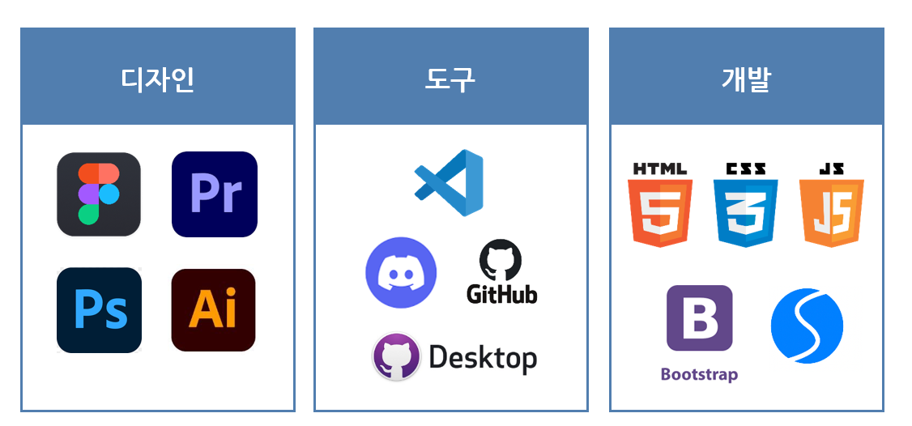

🌈 YJ Mini Team Project : Team Prism

# 🥽 스파밸리 웹사이트 [ 메인, 오시는길 ] 리뉴얼 프로젝트 <br>

제작기간 : " 23.06.12 - 23.06.30 " <br>

### Demo : https://spavalley-project.netlify.app/

---

## 💻목업 사진

<br>

<p align="center">
    
    
</p>

---

## 👨🏻‍🤝‍👨팀원 소개

<br>

<p align="center">
    
</p>

---

## 🧾기획 배경

<br>

<p align="center">
    
</p>

- 성인 남녀 835명을 대상으로 조사한 결과 80.1%가 여름 휴가를 계획하고 있다. 또한, 그 중 30.9%가 가까운 국내 여행을 계획하고 있다고 함.

<br/>

<p align="center">
    
</p>

- 여름 휴가에 맞추어 스파밸리 사이트의 방문자 숫자가 늘어나고 있음.

<br/>

<p align="center">
    
</p>

- 기존 웹사이트의 문제점
<p align="center">
    
</p>

---

## 📅개발 일정

<br>

<p align="center">
    
</p>

---

## 💻개발 환경

<br>

<p align="center">
    
</p>

---

## 📲구현 기능

<br>

1.  Open API 활용 \_ 구글 API를 활용하여 지도 삽입

    <p align="center">
        
    </p>

    ```javascript
    function initMap() {
      const map = new google.maps.Map(document.getElementById("map"), {
        zoom: 20,
        center: { lat: 35.78809837100381, lng: 128.63544134464186 }, // 지도의 중심 좌표
      });

      // 마커 정보
      var locations = [{ testId: "location01", lat: 35.78809837100381, lng: 128.63544134464186 }];

      // 마커 생성
      for (var i = 0; i < locations.length; i++) {
        var mapIcon = new google.maps.MarkerImage("images/map_google_marker.png");
        // 이미지 파일 경로를 설정해주면 다른 마커아이콘을 쓸 수 있음!
        var marker = new google.maps.Marker({
          map: map,
          position: new google.maps.LatLng(locations[i].lat, locations[i].lng),
          icon: mapIcon,
        });
        google.maps.event.addListener(
          marker,
          "click",
          (function (marker, i) {
            return function () {
              // 마커 클릭시 실행할 이벤트를 설정해줄 수 있다
              alert(locations[i].testId);
            };
          })(marker, i)
        );
      }
    }
    ```

    ```html
    <div id="map" style="width: 100%; height: 600px">지도가 들어가는 영역!</div>

    <script src="https://maps.googleapis.com/maps/api/js?key=0000000000000000000000&callback=initMap&libraries=&v=weekly" async></script>
    ```

<br>

2.  이미지 버튼 작은 이미지 클릭 시 큰 이미지가 바뀌게 구현

     <p align="center">
         
     </p>

    ```js
     // 이미지 클릭했을 때 변하게 하기 위해서
     let $inner_img = document.querySelector("#inner_img"),
         $outer_img = document.querySelector("#outer_img"),

     function innerButtonClickHandler() {
     const alt = this.parentNode.querySelector("img").alt;
     $inner_img.src = `./images/main_images/carousel_first/${alt}.jpg`;
     }

     function outerButtonClickHandler() {
     const alt = this.parentNode.querySelector("img").alt;
     $outer_img.src = `./images/main_images/carousel_second/${alt}.jpg`;
     }

     let $$inner_buttons = document.querySelectorAll("#inner_slides div img, #inner_slides div p.sub_text, #inner_slides div i.fa-x");
     let $$outer_buttons = document.querySelectorAll("#outer_slides div img, #outer_slides div p.sub_text");

     $$inner_buttons.forEach((button) => {
     button.addEventListener("click", innerButtonClickHandler);
     });

     $$outer_buttons.forEach((button) => {
     button.addEventListener("click", outerButtonClickHandler);
     });
    ```

---

## 👨‍💻자체 평가 및 의견

<br>

<p align="center">
    
    
    
</p>

---

<br>

## END
